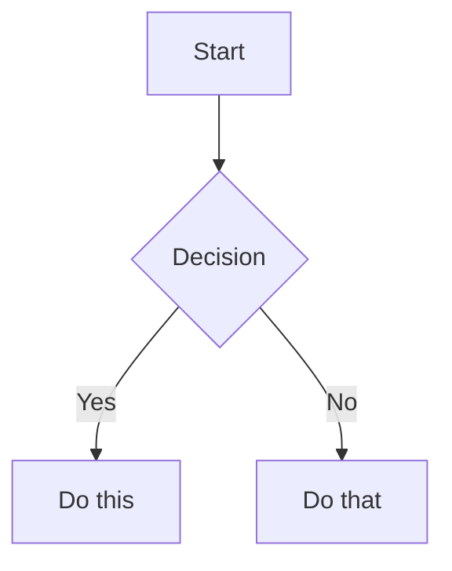

# Obsidian Flavored Markdown Syntax Reference

Obsidian uses a combination of Markdown flavors:

- [CommonMark](https://commonmark.org/)
- [GitHub Flavored Markdown](https://github.github.com/gfm/)
- [LaTeX](https://www.latex-project.org/) for math
- Obsidian-specific extensions (wikilinks, callouts, embeds, etc.)

## Table of Contents

- [Basic Formatting](#basic-formatting)
- [Internal Links (Wikilinks)](#internal-links-wikilinks)
- [Markdown-Style Links](#markdown-style-links)
- [Embeds](#embeds)
- [Callouts](#callouts)
- [Lists](#lists)
- [Code](#code)
- [Tables](#tables)
- [Math (LaTeX)](#math-latex)
- [Diagrams (Mermaid)](#diagrams-mermaid)
- [Footnotes](#footnotes)
- [Comments](#comments)
- [Properties (Frontmatter)](#properties-frontmatter)
- [Tags](#tags)

## Basic Formatting

### Paragraphs and Line Breaks

```markdown
This is a paragraph.

This is another paragraph (blank line between creates separate paragraphs).

For a line break within a paragraph, add two spaces at the end
or use Shift+Enter.
```

### Headings

```markdown
# Heading 1
## Heading 2
### Heading 3
#### Heading 4
##### Heading 5
###### Heading 6
```

### Text Formatting

| Style         | Syntax                   | Example           | Output          |
| ------------- | ------------------------ | ----------------- | --------------- |
| Bold          | `**text**` or `__text__` | `**Bold**`        | **Bold**        |
| Italic        | `*text*` or `_text_`     | `*Italic*`        | _Italic_        |
| Bold + Italic | `***text***`             | `***Both***`      | **_Both_**      |
| Strikethrough | `~~text~~`               | `~~Striked~~`     | ~~Striked~~     |
| Highlight     | `==text==`               | `==Highlighted==` | ==Highlighted== |
| Inline code   | `` `code` ``             | `` `code` ``      | `code`          |

### Escaping Formatting

Use backslash to escape special characters: `\*`, `\_`, `\#`, `` \` ``, `\|`, `\~`

## Internal Links (Wikilinks)

### Basic Links

```markdown
[[Note Name]]
[[Note Name|Display Text]]
```

### Link to Headings

```markdown
[[Note Name#Heading]]
[[Note Name#Heading|Custom Text]]
[[#Heading in same note]]
```

### Link to Blocks

```markdown
[[Note Name#^block-id]]
```

Define a block ID by adding `^block-id` at the end of a paragraph:

```markdown
This is a paragraph that can be linked to. ^my-block-id
```

### Search Links

```markdown
[[##heading]] Search for headings containing "heading"
[[^^block]] Search for blocks containing "block"
```

## Markdown-Style Links

```markdown
[Display Text](Note%20Name.md)
[Display Text](https://example.com)
[Note](obsidian://open?vault=VaultName&file=Note.md)
```

Note: Spaces must be URL-encoded as `%20` in Markdown links.

## Embeds

```markdown
![[Note Name]]
![[Note Name#Heading]]
![[image.png]]
![[image.png|300]]        Width only (maintains aspect ratio)
![[image.png|640x480]]    Width x Height
![[document.pdf]]
![[document.pdf#page=3]]
![[audio.mp3]]
```

External images:

```markdown


```

## Callouts

### Basic Callout

```markdown
> [!note]
> This is a note callout.

> [!info] Custom Title
> This callout has a custom title.
```

### Foldable Callouts

```markdown
> [!faq]- Collapsed by default
> This content is hidden until expanded.

> [!faq]+ Expanded by default
> This content is visible but can be collapsed.
```

### Nested Callouts

```markdown
> [!question] Outer callout
>
> > [!note] Inner callout
> > Nested content
```

### Supported Callout Types

| Type       | Aliases                | Description           |
| ---------- | ---------------------- | --------------------- |
| `note`     | -                      | Blue, pencil icon     |
| `abstract` | `summary`, `tldr`      | Teal, clipboard icon  |
| `info`     | -                      | Blue, info icon       |
| `todo`     | -                      | Blue, checkbox icon   |
| `tip`      | `hint`, `important`    | Cyan, flame icon      |
| `success`  | `check`, `done`        | Green, checkmark icon |
| `question` | `help`, `faq`          | Yellow, question mark |
| `warning`  | `caution`, `attention` | Orange, warning icon  |
| `failure`  | `fail`, `missing`      | Red, X icon           |
| `danger`   | `error`                | Red, zap icon         |
| `bug`      | -                      | Red, bug icon         |
| `example`  | -                      | Purple, list icon     |
| `quote`    | `cite`                 | Gray, quote icon      |

## Lists

```markdown
- Unordered item
  - Nested item

1. Ordered item
   1. Nested numbered

- [ ] Incomplete task
- [x] Completed task
```

## Code

````markdown
Use `backticks` for inline code.

```javascript
// Syntax highlighted code block
function hello() {
  console.log("Hello, world!");
}
```
````

## Tables

```markdown
| Left | Center | Right |
| :--- | :----: | ----: |
| L    |   C    |     R |
```

Escape pipes in tables: `\|`

## Math (LaTeX)

```markdown
Inline: $e^{i\pi} + 1 = 0$

Block:
$$
\sum_{i=1}^{n} x_i = x_1 + x_2 + \cdots + x_n
$$
```

## Diagrams (Mermaid)

````markdown

````

## Footnotes

```markdown
This sentence has a footnote[^1].

[^1]: This is the footnote content.

Inline footnotes are also supported.^[This is an inline footnote.]
```

## Comments

```markdown
This is visible %%but this is hidden%% text.

%%
This entire block is hidden in reading view.
%%
```

## Properties (Frontmatter)

Properties use YAML frontmatter at the start of a note:

```yaml
---
title: My Note Title
date: 2024-01-15
tags:
  - project
  - important
aliases:
  - My Note
  - Alternative Name
cssclasses:
  - custom-class
status: in-progress
rating: 4.5
completed: false
due: 2024-02-01T14:30:00
---
```

### Property Types

| Type        | Example                         |
| ----------- | ------------------------------- |
| Text        | `title: My Title`               |
| Number      | `rating: 4.5`                   |
| Checkbox    | `completed: true`               |
| Date        | `date: 2024-01-15`              |
| Date & Time | `due: 2024-01-15T14:30:00`      |
| List        | `tags: [one, two]` or YAML list |
| Links       | `related: "[[Other Note]]"`     |

### Default Properties

- `tags` - Note tags
- `aliases` - Alternative names for the note
- `cssclasses` - CSS classes applied to the note

## Tags

```markdown
#tag
#nested/tag
#tag-with-dashes
```

Tags can contain: letters (any language), numbers (not first char), underscores, hyphens, forward slashes (nesting).

## References

- [Basic formatting syntax](https://help.obsidian.md/syntax)
- [Advanced formatting syntax](https://help.obsidian.md/advanced-syntax)
- [Obsidian Flavored Markdown](https://help.obsidian.md/obsidian-flavored-markdown)
- [Internal links](https://help.obsidian.md/links)
- [Embed files](https://help.obsidian.md/embeds)
- [Callouts](https://help.obsidian.md/callouts)
- [Properties](https://help.obsidian.md/properties)
